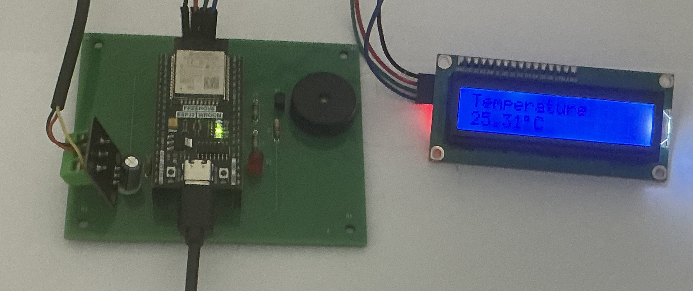
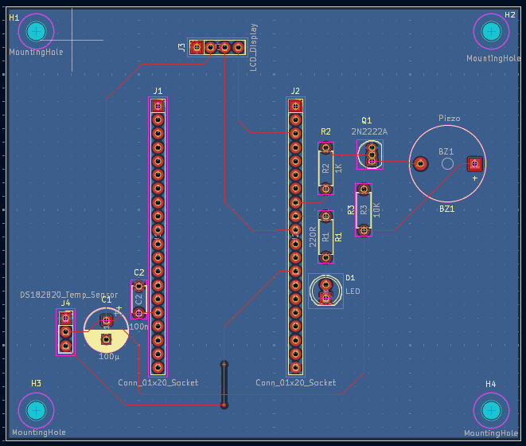
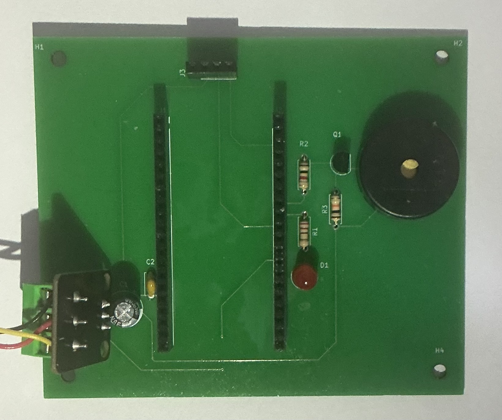

# Temperature Monitor System with IoT Integration

### Overview
This project is a temperature monitoring system using the DS18B20 digital temperature sensor and the ESP32, it is logged live to ThingSpeak. The PCB was created in KiCad. 

Link to ThingSpeak: https://thingspeak.mathworks.com/channels/3428295

### Components
The following components are used in this PCB. The 2N2222A transistor is not present in any previous versions 

| Component  | Function |
| ------------- | ------------- |
| Freenove ESP32 WROOM  | Manages all components and logic, wifi capabilities allow for live logging to ThingSpeak  |
| 2x 01x20 female to male header socket | Allows the ESP32 to be plugged onto the PCB |
| LCD screen with I2C backpack  | Displays current temperature  |
| 01x04 female to male header socket | Connects the LCD I2C backpack to the PCB  |
| 4x Male to female jumper wires | Connects to the LCD I2C backpack  |
| DS18B20 digital temperature sensor  | Measures temperature  |
| 01x03 screw terminal | holds the VCC, GND and data wires of the DS18B20  |
| 4.7 KΩ resistor  | Pull up resistor for DS18B20 sensor, is built in to the sensor hence is not in any diagrams  |
| Piezo | Informs user of specific temperature    |
| LED & 220Ω resistor  | Informs user of specific temperature  |
| 1KΩ resistor | Limits current from the ESP32 to a safe level  |
| 10KΩ resistor| Discharges residual charge of the piezo  |
| 100 µF electrolytic capacitor  | Stops low frequency noise  |
| 0.1 µF ceramic capacitor  | Stops high frequency noise  |
| Male to female jumper wires | Connects to the LCD I2C backpack  |
| 2N2222A Transistor | Protects the GPIO pin of the ESP32 from the capacitive nature of the piezo  |

### Code

The code is non-blocking via the use of millis() meaning output updates and logging can run without blocking the CPU. 
Structured with global variables corresponding to interval times and output thresholds allows for logic to be quickly alterd.
Implementation of functions which separate different processes allow for more efficient debugging, improved readability and reuse in other projects. 
The SDA and SCL default GPIO pins are manually set rectify a routing error in the PCB allowing for the I2C backpack to work.

## PCB and Circuit Design
### Circuit Diagram
The circuit diagram includes 2 01x20 sockets in order to accommodate the ESP32, with J1 being the left size whilst J2 is the right. On the PCB layout J1 and J2 are 25.4mm apart.
The 2N2222A transistor is included to protect the GPIO 19 pin, the buzzer symbol is used to represent a piezo, which does not have inductive properties hence no flyback diode is required. J3 represents the LCD screen which makes use of an I2C backpack.

### PCB layout
The PCB is 95mm by 80mm with a thickness of 1.6mm. J1 and J2 are 25.4mm apart. Components which will have wires attached are placed so that the wires do not get caught on other components. 90 degree turns are avoided to reduce interference.
The LCD is to be connected via jumper wires to the 01x04 sockets, it is separate as a screen may not be needed constantly for the PCB and hence must be easy to remove, directly plugging and unplugging the screen could cause damage to the PCB and the LCD backpack hence jumper wires are used instead.

### Simulation and Final PCB

Below is the 3D KiKad simulation of the PCB layout.

Below is the final PCB.

