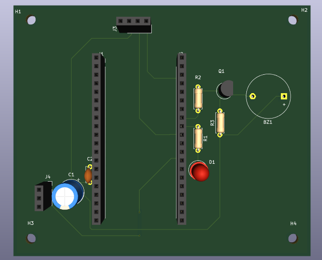
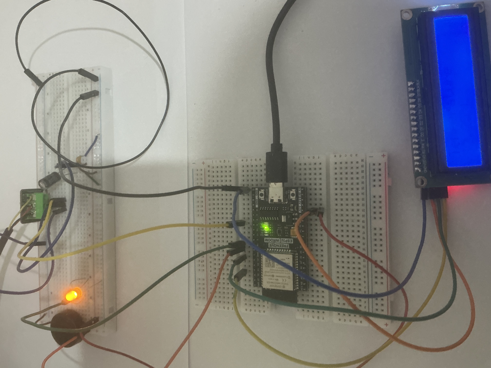

# Temperature Monitor System with IoT Integration

## Overview
This project is a temperature monitoring system using the DS18B20 digital temperature sensor and the ESP32, it is logged live to ThingSpeak. The PCB was created in KiKad. 
Link to ThingSpeak: https://thingspeak.mathworks.com/channels/3428297

In version one the Arduino UNO is used, it is replaced by the "freenove ESP32 wroom" in version two due to the Arduino Uno lacking WiFi capabilities. Version one did not include WiFi logging or a screen.
The OneWire and DallasTemperature libraries are used for the sensor.
Decoupling is implemented using an electrolytic and ceramic capacitor for low and high frequency noise.

## PCB and Circuit Design
The  includes 2 01x20 sockets in order to accommodate the ESP32, with J1 being the left size whilst J2 is the right. On the PCB layout J1 and J2 are 25.4mm apart.
The 2N2222A transistor is included to protect the GPIO pin the buzzer connects to.

The PCB is 95mm by 80mm with a thickness of 1.6mm.

Below is the 3D KiKad simulation of the PCB layout.

## Components
The following components are used in this PCB. The 2N2222A transistor is not present in any previous versions 
- ESP32
- LCD screen - 2x16
- DS18B20 digital temperature sensor
- 4.7 KΩ pull-up resistor (Included in sensor, hence not on diagram)
- Piezo buzzer
- 100 µF electrolytic capacitor
- 0.1 µF ceramic capacitor
- LED & Current limiting resistor
- Breadboard and jumper wires
- 2N2222A Transistor
- 1KΩ and 10kΩ for transistor network

## Versions
The following versions are prototypes before the final PCB was designed

## Breadboard V2
Note that the DS18B20 sensor used has a built in pull up resistor hence no pull up resistor is included on the breadboard.
This version did not have a transistor or its accompanying resitors, the piezo connects directly to the GPIO pin.

# Version 1 

Version one included the DS18B20 with the arduino UNO, readings were logged to a laptop a piezo and LED the user was informed if temperature exeeded certain thresholds.

## Components for version one
- Arduino Uno
- DS18B20 digital temperature sensor
- 4.7 kΩ pull-up resistor
- Piezo buzzer
- 100 µF electrolytic capacitor
- 0.1 µF ceramic capacitor
- LED & Current limiting resistor
- Breadboard and jumper wires

Note that the DS18B20 sensor used has a built in pull up resistor hence no pull up resistor is included on the breadboard.

## Initial Diagram
Made in tinker CAD, note that due to tinker CAD component limitations there is no DS18B20 model hence a TMP36 model is used as a place holder.
This is the initial concept design and is not accurate to version one

