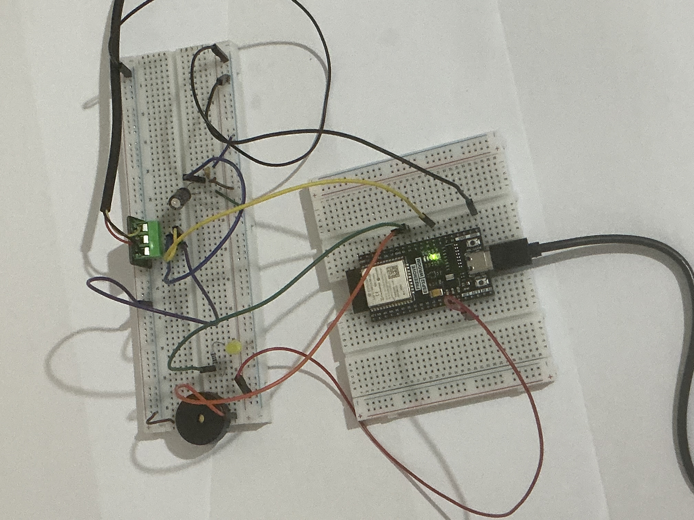
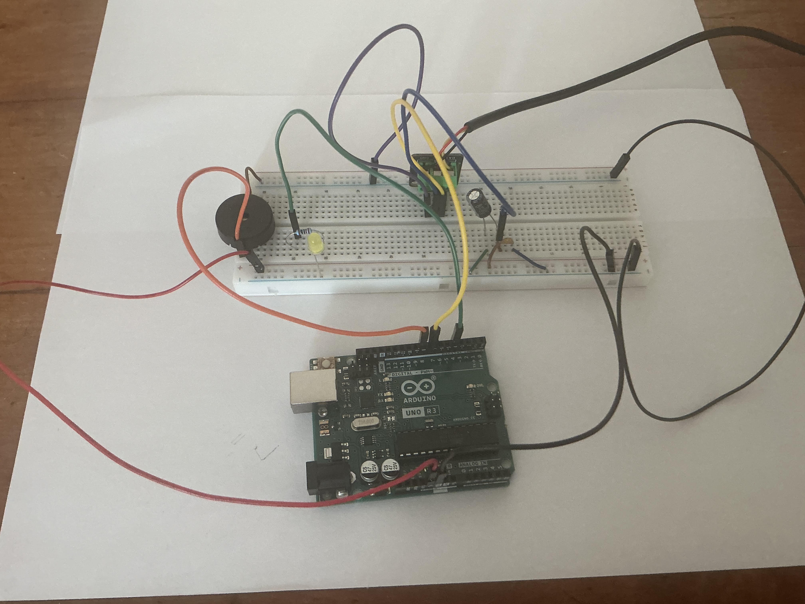

# Temperature Monitor System with IoT Integration

## Overview (of V2)
This project is a temperature monitoring system using the DS18B20 digital temperature sensor and the ESP32, it is logged live to ThingSpeak.
Link to ThingSpeak: https://thingspeak.mathworks.com/channels/3428297

In version one the Arduino UNO is used, it is replaced by the ESP32 in version two due to the Arduino Uno lacking WiFi capabilities. Version one did not include WiFi logging or a screen.
The OneWire and DallasTemperature libraries are used for the sensor.
Decoupling is implemented using an electrolytic and ceramic capacitor for low and high frequency noise.

## Components
- ESP32
- LCD screen - 2x16
- DS18B20 digital temperature sensor
- 4.7 kΩ pull-up resistor
- Piezo buzzer
- 100 µF electrolytic capacitor
- 0.1 µF ceramic capacitor
- LED & Current limiting resistor
- Breadboard and jumper wires

## Breadboard V2
Note that this picture is outdated, the most recent version includes the LCD. The picture will be updated.
Note that the DS18B20 sensor used has a built in pull up resistor hence no pull up resistor is included on the breadboard.

# Version 1 

Version one included the DS18B20 with the arduino UNO, readings were logged to a laptop a piezo and LED the user was informed if temperature exeeded certain thresholds.

## Components for version one
- Arduino Uno
- DS18B20 digital temperature sensor
- 4.7 kΩ pull-up resistor
- Piezo buzzer
- 100 µF electrolytic capacitor
- 0.1 µF ceramic capacitor
- LED & Current limiting resistor
- Breadboard and jumper wires

Note that the DS18B20 sensor used has a built in pull up resistor hence no pull up resistor is included on the breadboard.

## Initial Diagram
Made in tinker CAD, note that due to tinker CAD component limitations there is no DS18B20 model hence a TMP36 model is used as a place holder.
This is the initial concept design and is not accurate to version one

